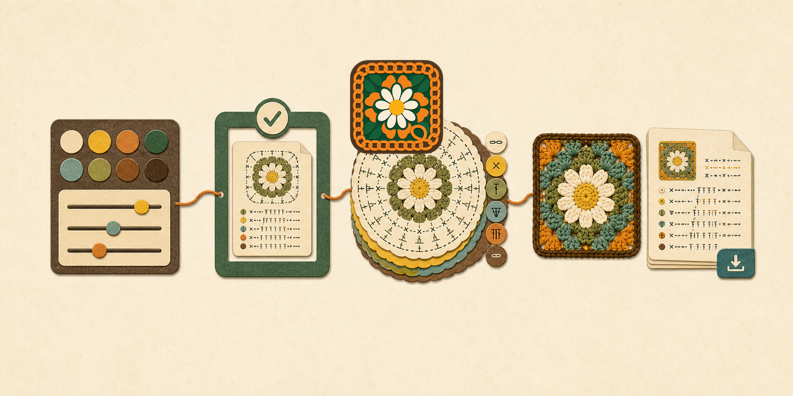

# Stitch Forge



Stitch Forge is a browser-local procedural crochet-pattern studio for the Retro Daisy Granny Square. It normalizes recipe inputs, creates one structured pattern artifact, formats round-by-round instructions, and feeds the same artifact into a Three.js preview.

[Open the deployed studio](https://luminarylabs-dev.github.io/stitch-forge/)

## What it provides

- Retro Daisy patterns with 3 through 8 rounds.
- Recipe-safe petal layouts of 4, 8, 12, or 16 petals.
- Center, petal, and border colors plus preview softness, glow, and depth controls.
- One validated artifact shared by instructions, summaries, export, and preview parameters.
- Clipboard copy and plain-text download from the browser.
- Structural verification for default, boundary, and normalized-input scenarios.

## Run locally

```bash
npm ci
npm run dev
```

Open the local URL printed by Vite.

## Verify and build

```bash
npm run verify:patterns
npm run build
```

`verify:patterns` exercises four scenarios and checks round alignment, petal normalization, stitch totals, export content, and render-band bounds. The production build is emitted to the ignored `dist/` directory.

## Recipe constraints

| Input | Supported values |
| --- | --- |
| Rounds | 3 through 8 |
| Petal count | 4, 8, 12, or 16 |

Unsupported values are normalized before pattern construction, formatting, rendering, or export. The interface reports normalization notes to the user.

## Architecture

```text
controls and preset
  -> input normalization
    -> structured pattern artifact
      +-> formatted instructions and text export
      `-> Three.js preview parameters
```

| Path | Responsibility |
| --- | --- |
| `src/ui.js` | Controls, state, recipe notes, pattern display, and export actions. |
| `src/generator.js` | Pattern-generation composition entry point. |
| `src/validation.js` | Recipe-safe input normalization. |
| `src/pattern-model.js` | Structured rounds, counts, materials, summaries, and render bands. |
| `src/formatter.js` | On-screen and plain-text instructions. |
| `src/renderer.js` | Three.js scene, shader preview, controls, and renderer lifecycle. |
| `scripts/verify-patterns.mjs` | Four representative artifact checks. |

See [docs/ARCHITECTURE.md](docs/ARCHITECTURE.md) for the full boundary map.

## Current preview limitation

At the current `main` revision, `createRenderer()` measures its preview container before `createApp()` is attached to the document. The initial canvas is therefore `0 x 0` and can appear blank. A viewport resize invokes the renderer's resize handler and creates a non-zero drawing buffer, but initial visual rendering remains an open product defect. Pattern generation, text display, validation, and export are separate from that preview initialization path.

This documentation cycle records the limitation but does not change application source.

## Deployment

GitHub Pages deploys from `main` through `.github/workflows/deploy-pages.yml`. Treat local verification, the Actions result, and the live site as three separate gates.

## Documentation

- [Documentation index](docs/README.md)
- [Architecture](docs/ARCHITECTURE.md)
- [Operations](docs/OPERATIONS.md)
- [Validation](docs/VALIDATION.md)
- [Visual identity](docs/visual-identity.md)

## License

No open-source license is granted for this repository at this time.
